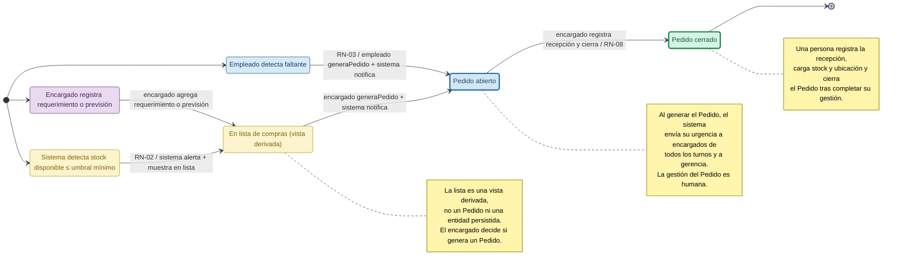

# Máquina de estado — Pedido de compra

> Propuesta para T04. Se basa en `docs/dominio/dominio.md`, que deja abiertos los estados de Pedido para modelarlos en M1. El pedido representa una solicitud interna de reposición; la compra y la logística con proveedores quedan fuera del alcance.

## Diagrama de creación y estados

El sistema automatiza únicamente las acciones que el dominio indica de forma explícita: detectar el umbral, generar una alerta, mostrar el repuesto en la lista de compras derivada y enviar las notificaciones previstas. La creación del Pedido, la gestión de la recepción y el cierre requieren intervención humana. Llegar al umbral no crea por sí solo un Pedido.

### Código de colores

| Color del diagrama | Elementos que representa |
| --- | --- |
| Azul | Empleado de mantenimiento. |
| Violeta | Encargado de mantenimiento. |
| Amarillo | Sistema y lista de compras derivada. |
| Azul claro | Pedido abierto, en gestión humana. |
| Verde claro | Pedido cerrado por una persona. |

## Estados y transiciones

| Estado | Significado |
| --- | --- |
| `EnLista` | El repuesto está bajo umbral o fue agregado manualmente como requerimiento/previsión. Es una vista derivada, no un Pedido. |
| `PedidoAbierto` | Una persona generó el Pedido y todavía debe gestionar la reposición y su recepción. Al generarlo se notifica por correo con la urgencia correspondiente. |
| `PedidoCerrado` | Una persona responsable completó la gestión, registró la recepción y cargó el stock y la ubicación. Es un estado final. |

La urgencia (`normal` o `urgente`) es un atributo del Pedido, no un estado. La detección del umbral no crea un Pedido: el sistema genera la alerta y presenta el repuesto en la lista; el encargado decide y ejecuta la creación del Pedido. Cuando no hay stock disponible para una solicitud, el empleado puede generar manualmente un Pedido según RN-03.

| Transición | Condición y efecto | Fuente |
| --- | --- | --- |
| `detectarUmbral` → `EnLista` | Si el stock disponible es menor o igual al umbral, el sistema genera una alerta y muestra el repuesto en la lista de compras. No crea un Pedido. | RN-02; sección 7 del dominio. |
| `registrarRequerimiento` → `EnLista` | El encargado agrega un requerimiento específico o una previsión a la lista. | Sección 1 y glosario del dominio. |
| `generarPedido` → `PedidoAbierto` | El empleado genera un Pedido al detectar falta de stock, o el encargado lo genera al gestionar la lista. La creación es humana; al generarlo, el sistema notifica por correo la solicitud y su urgencia a los encargados de todos los turnos y a gerencia. | RN-03, RN-04 y RN-09; secciones 1 y 7 del dominio. |
| `registrarRecepcionYCerrar` → `PedidoCerrado` | Una persona registra la recepción; se carga el stock físico y la ubicación y la persona responsable cierra el Pedido. | RN-06 y RN-08. |

## Restricciones del modelo

- Las acciones automáticas se limitan a las explícitas en el dominio: alerta y aparición en la lista al alcanzar el umbral, y notificación por correo al generarse un Pedido.
- La lista de compras es una vista derivada. El umbral no genera automáticamente un Pedido; una persona decide y lo crea.
- Crear, gestionar la recepción y cerrar el Pedido son acciones humanas. El encargado puede delegar la carga del stock, pero conserva la supervisión según RN-08.
- `PedidoCerrado` requiere intervención humana. El sistema no cierra el Pedido automáticamente al cambiar el stock ni al registrar una recepción.
- El Pedido mantiene su urgencia como atributo. La notificación a encargados de todos los turnos y gerencia ocurre al generarse, no al cerrar.
- No se modelan aprobación, cancelación ni logística con proveedores porque el dominio no define esos pasos.
- **Supuesto de cierre:** la persona responsable cierra el Pedido una vez registrada la recepción completa de sus líneas y cargados stock y ubicación. El dominio no define cómo tratar recepciones parciales.

## Decisiones a validar con el equipo

- **Recepciones parciales:** el dominio no define si pueden llegar líneas o cantidades en distintas entregas. Si se admiten, mantener el Pedido abierto hasta completar la recepción y acordar cómo registrar cada entrega.
- **Criterio y responsable del cierre:** se propone que el encargado responsable cierre el Pedido tras verificar la recepción completa y la carga de stock y ubicación; confirmar si ese criterio refleja el proceso del equipo.
- **Cancelación:** el dominio no define si un Pedido puede cancelarse ni qué rol lo haría. No se incorpora al flujo base hasta acordarlo.

## Referencias

- `docs/dominio/dominio.md`, secciones 1 y 2: detección del umbral, stock disponible y definición del pedido.
- `docs/dominio/dominio.md`, sección 4: RN-02 (umbral), RN-03 (faltante → compra), RN-04 (urgencia), RN-06 (trazabilidad), RN-08 (recepción) y RN-09 (notificaciones).
- `docs/dominio/dominio.md`, sección 7: la lista de compras es una vista derivada y los estados del Pedido quedan abiertos para la máquina de M1.
- `docs/cronograma_alumnos.md`, sección 4: la máquina de estado de Pedido forma parte del entregable M1.
