# Máquina de estado — Pedido de compra

> Propuesta para T04. Se basa en `docs/dominio/dominio.md`, que deja abiertos los estados de Pedido para modelarlos en M1. El pedido representa una solicitud interna de reposición; la compra y la logística con proveedores quedan fuera del alcance.

## Diagrama de creación y estados

El flujo distingue quién origina la solicitud y obliga a que toda creación pase por una persona responsable. La baja de stock inicializa el pedido en `Creado`; después se asigna un revisor humano y el pedido queda pendiente de aprobación. Desde allí puede avanzar a `Confirmado` o terminar en `Cancelado`.

```mermaid
stateDiagram-v2
    direction LR

    [*] --> FaltanteDetectado
    [*] --> RequerimientoEncargado
    [*] --> UmbralDetectado

    state "Empleado de mantenimiento detecta faltante" as FaltanteDetectado
    state "Encargado ingresa requerimiento o previsión" as RequerimientoEncargado
    state "Sistema detecta stock disponible ≤ umbral mínimo" as UmbralDetectado
    state "Creado (iniciado)" as Creado
    state "Pendiente de revisión (responsable asignado)" as PendienteDeRevision
    state "Pendiente de aprobación (revisión humana)" as PendienteDeAprobacion
    state "Confirmado" as Confirmado
    state "Cancelado" as Cancelado
    state "Pendiente de recepción" as PendienteDeRecepcion
    state "Recibido" as Recibido

    FaltanteDetectado --> Creado : RN-03 / generarPedido manual
    RequerimientoEncargado --> Creado : generarPedido manual
    UmbralDetectado --> Creado : RN-02 / inicializarPedido automatico + generar alerta/lista

    Creado --> PendienteDeRevision : asignarResponsable
    PendienteDeRevision --> PendienteDeAprobacion : iniciarRevision
    PendienteDeAprobacion --> Confirmado : aprobarPedido / revisor humano verifica
    PendienteDeAprobacion --> Cancelado : cancelarPedido / revisor humano rechaza
    Confirmado --> PendienteDeRecepcion : confirmarPedido / notificarPorCorreo
    PendienteDeRecepcion --> PendienteDeRecepcion : recepción incompleta
    PendienteDeRecepcion --> Recibido : registrarRecepcion [todas las líneas] / cargarStockYUbicacion
    Recibido --> [*]
    Cancelado --> [*]

    note right of UmbralDetectado
        RN-02 mantiene la alerta y la
        entrada en la lista de compras.
        En este modelo, el mismo evento
        también inicializa un Pedido.
    end note

    note right of PendienteDeAprobacion
        Solo una persona responsable
        puede aprobar o cancelar.
        El origen automático no salta
        esta revisión humana.
    end note

    note right of Cancelado
        Estado final sin recepción
        ni carga de stock.
    end note

    classDef actorEmpleado fill:#D6EAF8,stroke:#1B4F72,color:#154360
    classDef actorEncargado fill:#E8DAEF,stroke:#6C3483,color:#4A235A
    classDef actorSistema fill:#FCF3CF,stroke:#B7950B,color:#7D6608
    classDef inicial fill:#D5F5E3,stroke:#1E8449,color:#145A32,stroke-width:3px
    classDef revision fill:#FDEBD0,stroke:#CA6F1E,color:#784212,stroke-width:3px
    classDef confirmado fill:#ABEBC6,stroke:#239B56,color:#145A32,stroke-width:3px
    classDef cancelado fill:#F5B7B1,stroke:#C0392B,color:#78281F,stroke-width:3px
    classDef recepcion fill:#D4E6F1,stroke:#2874A6,color:#1B4F72,stroke-width:3px
    class FaltanteDetectado actorEmpleado
    class RequerimientoEncargado actorEncargado
    class UmbralDetectado actorSistema
    class Creado inicial
    class PendienteDeRevision,PendienteDeAprobacion revision
    class Confirmado confirmado
    class Cancelado cancelado
    class PendienteDeRecepcion,Recibido recepcion
```

### Código de colores

| Color del diagrama | Elementos que representa |
| --- | --- |
| Azul | Empleado de mantenimiento. |
| Violeta | Encargado de mantenimiento. |
| Amarillo | Sistema que detecta el umbral. |
| Verde claro | Estado inicial `Creado`. |
| Naranja | Revisión y aprobación humana. |
| Verde intenso | Pedido confirmado. |
| Rojo claro | Pedido cancelado. |
| Azul claro | Recepción y estado final `Recibido`. |

## Estados y transiciones

| Estado | Significado |
| --- | --- |
| `Creado` | El sistema inicializó el pedido, de forma automática o manual, pero todavía no tiene una revisión asignada. |
| `PendienteDeRevision` | El pedido tiene una persona responsable asignada y espera que comience la revisión. |
| `PendienteDeAprobacion` | La persona responsable verifica las líneas, cantidades y urgencia. Desde este estado puede aprobar o cancelar. |
| `Confirmado` | La revisión humana aprobó el pedido y se puede continuar con la recepción. |
| `Cancelado` | La revisión humana rechazó o canceló el pedido. Es un estado final y no genera recepción. |
| `PendienteDeRecepcion` | El pedido confirmado todavía no fue recibido por completo. |
| `Recibido` | Se registró la recepción de todas sus líneas y se cargaron el stock físico y la ubicación. Es un estado final. |

El atributo `origen` permite distinguir `manual` y `automatico` sin convertir el tipo de creación en un estado. La urgencia (`normal` o `urgente`) también es un atributo del pedido. El origen automático solo determina cómo se llega a `Creado`; no evita la asignación, la revisión ni la posibilidad de cancelación.

| Transición | Condición y efecto | Fuente |
| --- | --- | --- |
| `generarPedido` → `Creado` | El empleado solicita una reposición ante un faltante de stock disponible, o el encargado genera el pedido desde un requerimiento, una previsión o la lista de compras. | RN-03; glosario y sección 7 del dominio. |
| `detectarUmbral` → `Creado` | Cuando el stock disponible es menor o igual al umbral mínimo, el sistema genera la alerta, incorpora el repuesto a la lista y, según este modelo, inicializa un pedido con origen `automatico`. | RN-02; decisión de modelado para T04. |
| `asignarResponsable` → `PendienteDeRevision` | Se asigna una persona dentro del sistema para revisar el pedido. | Decisión de modelado para T04. |
| `iniciarRevision` → `PendienteDeAprobacion` | El responsable comienza la verificación humana de las líneas, cantidades y urgencia. | RN-04 y decisión de modelado para T04. |
| `aprobarPedido` → `Confirmado` | El responsable valida el pedido y lo confirma para continuar con la recepción. | Decisión de modelado para T04. |
| `cancelarPedido` → `Cancelado` | El responsable rechaza o cancela el pedido antes de la recepción. El flujo termina y no se carga stock. | Decisión de modelado para T04. |
| `confirmarPedido` → `PendienteDeRecepcion` | El pedido aprobado queda pendiente de recepción y se notifica por correo a los encargados de todos los turnos y a gerencia. | RN-04 y RN-09. |
| `registrarRecepcion` → `Recibido` | Al recibir la compra, el encargado carga el stock físico y la ubicación, o delega esa tarea y la supervisa. La recepción queda vinculada con el pedido para reconstruir la historia del repuesto. | RN-06 y RN-08. |

## Restricciones del modelo

- La conducta explícita del dominio es: umbral mínimo → alerta + entrada en la **lista de compras**. En este modelo se agrega la decisión del equipo de inicializar además un pedido en `Creado`.
- La creación automática solo determina el origen del pedido. El pedido debe pasar por asignación, revisión humana y aprobación o cancelación.
- La urgencia es un **atributo** del pedido, no un estado. La notificación por correo ocurre al confirmar el pedido, no reemplaza la revisión humana.
- `Cancelado` es un estado final válido: no pasa a recepción ni modifica el stock.
- **Supuesto de cierre:** `Recibido` exige que se haya registrado la recepción de todas las líneas con sus cantidades y la carga de stock y ubicación. El dominio no define el criterio de completitud; se propone este para no cerrar un pedido solo por haber llegado físicamente la compra.
- La transición de recepción se registra una sola vez para evitar cargar dos veces el mismo stock. Su implementación deberá mantener vinculados pedido, recepción y movimientos de stock.
- No se modelan aprobación, envío al proveedor, despacho ni entrega en tránsito: el dominio excluye la logística externa.

## Decisiones a validar con el equipo

- **Automatización por umbral:** este modelo adopta que el evento `stock disponible ≤ umbral mínimo` crea un pedido en `Creado`, además de generar la alerta/lista de RN-02. Debe acordarse cómo evitar pedidos duplicados para las mismas líneas mientras exista uno abierto, revisándose o pendiente de recepción.
- **Recepciones parciales:** el dominio no define si pueden llegar líneas o cantidades en distintas entregas. Si se admiten, agregar `ParcialmenteRecibido` y registrar cada recepción sin duplicar stock; pasar a `Recibido` solo cuando se completen todas las líneas.
- **Cancelación:** no está definida. Si se necesita, acordar quién puede cancelar un pedido pendiente y qué sucede con las notificaciones y la trazabilidad.

## Referencias

- `docs/dominio/dominio.md`, secciones 1 y 2: detección del umbral, stock disponible y definición del pedido.
- `docs/dominio/dominio.md`, sección 4: RN-02 (umbral), RN-03 (faltante → compra), RN-04 (urgencia), RN-06 (trazabilidad), RN-08 (recepción) y RN-09 (notificaciones).
- `docs/dominio/dominio.md`, sección 7: la lista de compras es una vista derivada y el pedido materializa sus líneas; los estados del Pedido quedan abiertos para la máquina de M1.
- `docs/cronograma_alumnos.md`, sección 4: la máquina de estado de Pedido forma parte del entregable M1.
