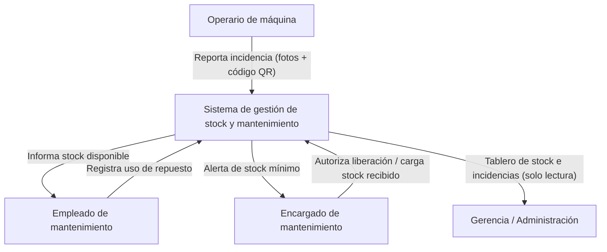

# Diagrama contextual del sistema

> T03. Sistema de gestión de stock y mantenimiento, y los flujos de información con cada uno de los 4 actores identificados en el dominio.

```mermaid
flowchart TD
    Operario["Operario de máquina"] -- "Reporta incidencia (fotos + código QR)" --> Sistema

    Empleado["Empleado de mantenimiento"] -- "Registra uso de repuesto" --> Sistema
    Sistema -- "Informa stock disponible" --> Empleado

    Sistema -- "Alerta de stock mínimo" --> Encargado["Encargado de mantenimiento"]
    Encargado -- "Autoriza liberación / carga stock recibido" --> Sistema

    Sistema -- "Tablero de stock e incidencias (solo lectura)" --> Gerencia["Gerencia / Administración"]

    Sistema["Sistema de gestión de stock y mantenimiento"]
```
