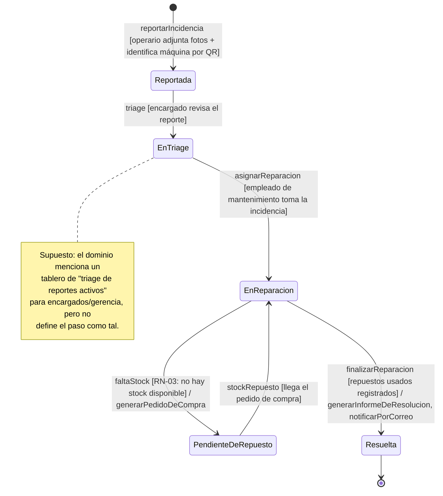

# Máquina de estado — Incidencia

> Borrador (T01). Basado en el dominio (`docs/dominio/dominio.md`) y en `docs/caso-de-uso.md` (CUN-01). Los pasos marcados como **supuesto** no están explícitos en el dominio — están ahí porque hacen falta para que la máquina cierre, y hay que validarlos con el resto del equipo antes de darla por definitiva.

## Diagrama

## Justificación de cada transición

| Transición | Regla / fuente |
| --- | --- |
| `reportarIncidencia` | Dominio, línea 17: el operario reporta incidencias adjuntando fotos e identificando la máquina por QR, en cualquier turno. |
| `EnTriage` (supuesto) | Dominio, línea 27: existe un tablero de "triage de reportes activos" para encargados — se infiere un paso de revisión antes de asignar, a confirmar. |
| `asignarReparacion` | Necesario para llegar al estado `En reparación`, que ya está referenciado como precondición del CUN-01 en `docs/caso-de-uso.md`. |
| `faltaStock` → `PendienteDeRepuesto` | RN-03: si no hay stock disponible, el empleado reporta y puede generar un pedido de compra. Coincide con el escenario alternativo del CUN-01 ("la reparación queda pendiente de ese repuesto"). |
| `stockRepuesto` (vuelta a `EnReparacion`) | Supuesto: una vez llega el pedido de compra, la reparación se retoma. El dominio no dice explícitamente que vuelve a este estado puntual. |
| `finalizarReparacion` | Dominio, línea 25: cada informe de resolución se almacena y se notifica por correo electrónico. |

## Qué falta validar con el equipo

- ¿`EnTriage` es un estado real o la asignación es automática/directa? Si no aplica, se colapsa `Reportada → EnReparacion` directo.
- ¿Existe un estado `Cancelada` (ej. reporte duplicado o erróneo)? No hay mención en el dominio, pero es común en este tipo de flujo.
- ¿`Resuelta` es el estado final, o hay un cierre posterior (ej. `Cerrada` tras validación del encargado)?
