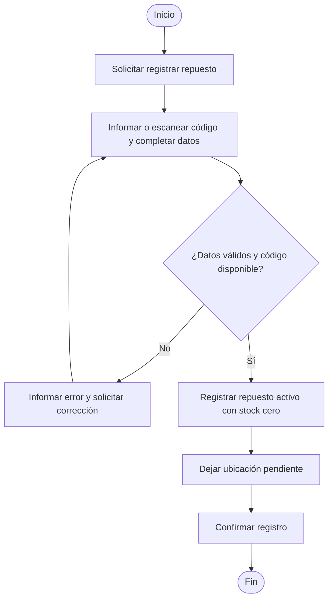
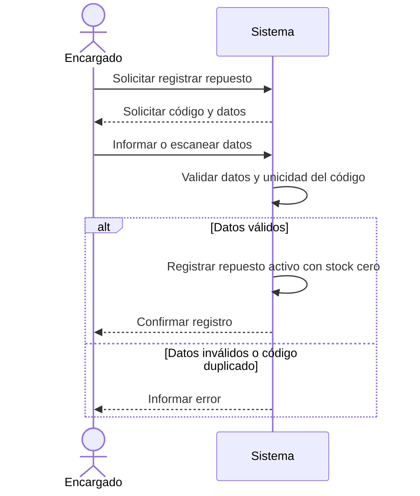

# CUN-02: Registrar un repuesto

## Objetivo

Permitir que el encargado de mantenimiento incorpore un nuevo repuesto al catálogo de la planta para que pueda ser identificado, consultado y utilizado en futuras operaciones de mantenimiento.

El registro describe el repuesto como elemento del catálogo. No representa todavía la recepción de unidades físicas ni la asignación de una ubicación dentro del almacén.

## Prioridad

Alta

## Actor principal

Encargado de mantenimiento.

## Actores secundarios

- Ninguno.

## Disparador

El encargado de mantenimiento necesita incorporar al catálogo un repuesto que todavía no se encuentra registrado.

## Precondiciones

- El encargado de mantenimiento se encuentra identificado y cuenta con permisos para gestionar el catálogo.
- El repuesto todavía no se encuentra registrado con el mismo código QR o de barras.

## Flujo principal

1. El encargado de mantenimiento solicita registrar un repuesto.
2. El sistema solicita el código QR o de barras, el nombre, la descripción y el umbral mínimo del repuesto.
3. El encargado de mantenimiento informa los datos del repuesto.
4. El sistema valida que los datos obligatorios estén completos y que el código no esté utilizado por otro repuesto.
5. El sistema registra el repuesto como activo en el catálogo.
6. El sistema establece el stock físico, el stock reservado y el stock disponible en cero.
7. El sistema deja la ubicación sin asignar hasta que se registre una recepción de stock.
8. El sistema informa que el repuesto fue registrado correctamente.

## Escenarios alternativos

### Registrar un repuesto mediante escaneo

En el paso 3, el encargado de mantenimiento puede escanear el código QR o de barras en lugar de ingresarlo manualmente. El sistema continúa con la validación de los datos.

## Escenarios de excepción

### Código ya registrado

En el paso 4, si el código QR o de barras ya pertenece a un repuesto del catálogo, el sistema informa la situación y no crea un nuevo registro.

### Datos incompletos o inválidos

En el paso 4, si falta un dato obligatorio o el umbral mínimo no es un número entero mayor o igual que cero, el sistema informa qué debe corregirse y permite volver a cargar los datos.

### Error al guardar el registro

En los pasos 5 a 7, si el sistema no puede completar el registro, informa que la operación no fue realizada y conserva el catálogo sin cambios parciales.

## Postcondiciones

- El repuesto queda registrado como activo en el catálogo.
- El repuesto cuenta con un código único, nombre, descripción y umbral mínimo.
- El stock físico, reservado y disponible quedan inicialmente en cero.
- La ubicación queda pendiente de asignación hasta la recepción de unidades.
- No se registra un movimiento de stock porque todavía no ingresaron unidades físicas.

## Reglas de negocio relacionadas

- RN-02 — Umbral.

## Requisitos funcionales derivados

- RF-01 — Registrar un repuesto en el catálogo.

## Requisitos no funcionales relacionados

- RNF-01 — Validar y confirmar la operación con una respuesta clara y rápida.

## Requisitos técnicos relacionados

- RT-02 — Separar DTOs, dominio y modelos de persistencia.
- RT-04 — Proteger las operaciones según el rol autenticado.
- RT-06 — Mantener un modelo de datos alineado con los casos de uso.

## Datos involucrados

- Código QR o de barras.
- Nombre del repuesto.
- Descripción.
- Umbral mínimo.
- Estado del repuesto.
- Stock físico, reservado y disponible.
- Ubicación pendiente de asignación.

## Historias de usuario relacionadas

- HU-01 — Registrar un repuesto para incorporarlo al catálogo de mantenimiento.

## Criterios de aceptación

### Registrar un nuevo repuesto

**Dado** que el encargado de mantenimiento está autorizado y el código no existe, **cuando** informa los datos válidos del repuesto, **entonces** el sistema lo registra como activo con stock físico, reservado y disponible en cero.

### Rechazar un código duplicado

**Dado** que el código ya pertenece a un repuesto, **cuando** el encargado intenta registrarlo nuevamente, **entonces** el sistema rechaza la operación y no duplica el registro.

### Rechazar datos inválidos

**Dado** que falta un dato obligatorio o el umbral mínimo es inválido, **cuando** el encargado intenta confirmar el registro, **entonces** el sistema informa el error y conserva el catálogo sin cambios.

## Diagrama de actividad

## Diagrama de secuencia

