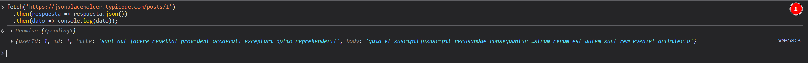
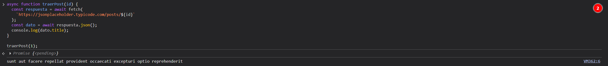
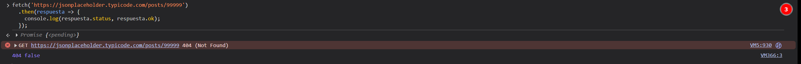
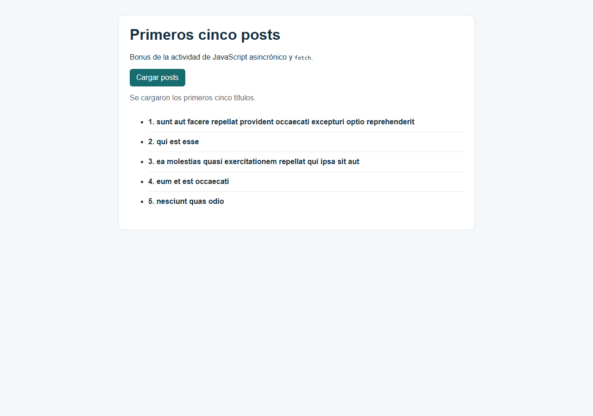
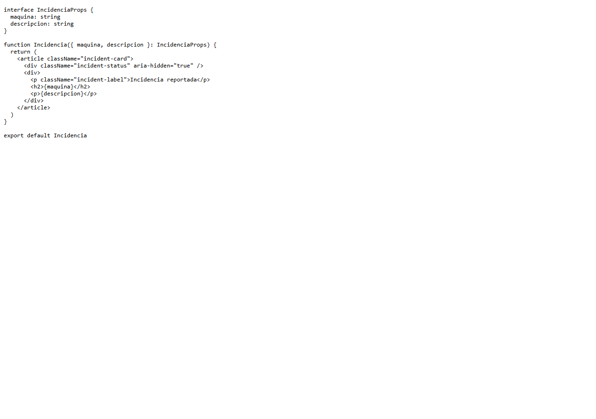
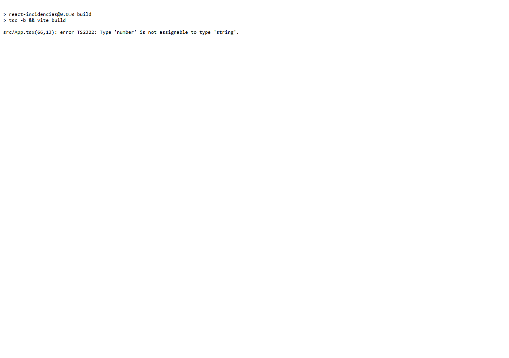
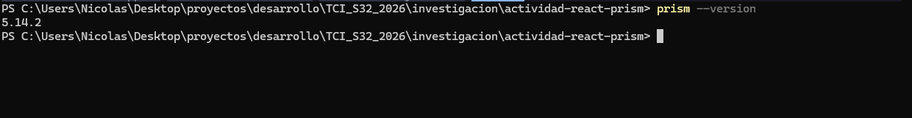
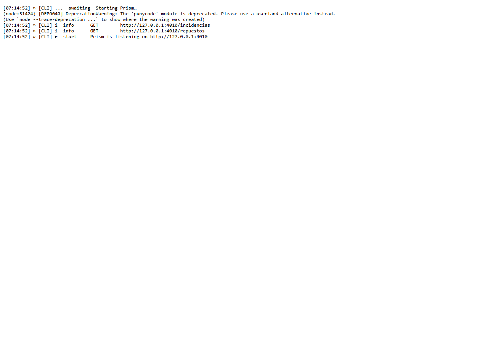

# Investigación: Pieroni, Nicolas (Legajo 31064)

Este ticket reúne la investigación y las actividades realizadas durante la semana.

## Parte A: JavaScript asincrónico, fetch y SPA

### Preguntas de búsqueda

1. ¿Qué es una SPA y en qué se diferencia de una página tradicional?
2. ¿Qué es una promesa en JavaScript y qué problema resuelve?
3. ¿Por qué `fetch` devuelve una promesa en lugar de devolver directamente los datos?
4. ¿Qué diferencias hay entre `XMLHttpRequest` y `fetch`?

### Preguntas guía

1. ¿Qué significa que `fetch` sea asincrónico? ¿Qué pasaría con la página si no lo fuera?
2. ¿Por qué `respuesta.json()` también devuelve una promesa?
3. ¿Qué relación hay entre una SPA y `fetch`? ¿Por qué una SPA necesita pedir datos de esa manera?

### Respuestas

#### 1. ¿Qué es una SPA y en qué se diferencia de una página tradicional?

Una SPA, o `Single-Page Application`, es una aplicación diseñada generalmente con algún framework de desarrollo frontend, donde todo ocurre a partir de transformaciones dinámicas dentro de una sola página. Básicamente, dentro de un solo documento HTML se van haciendo consultas para pedir datos, en vez de tener muchas páginas HTML separadas y tener que cargar una página completa cada vez.

Es una forma de desarrollar y empaquetar aplicaciones web complejas de una manera ordenada, siguiendo las reglas que propone la estructura del framework. Algunos frameworks pueden usar un DOM virtual para organizar esas transformaciones, aunque eso no es lo que define a una SPA.

#### 2. ¿Qué es una promesa en JavaScript y qué problema resuelve?

Una promesa es una solución que encontró JavaScript para hacer una capa de abstracción sobre operaciones que dependen de algo externo, como peticiones a servidores, bases de datos o sistemas que no sabemos si van a responder, ni cuándo ni si lo van a hacer satisfactoriamente.

Consiste básicamente en un objeto que se va resolviendo a medida que pasa el tiempo y que puede ser observado para verificar su resultado. La promesa puede esperarse con `await`, pero mientras sigue pendiente se pueden hacer otras cosas dentro del código. También puede terminar correctamente o fallar, y esos dos resultados se pueden manejar de forma diferente.

#### 3. ¿Por qué `fetch` devuelve una promesa en lugar de devolver directamente los datos?

`fetch` devuelve una promesa porque se utiliza para hacer peticiones a recursos externos y no sabemos cuánto va a tardar la respuesta, ni si la petición va a terminar correctamente.

Entonces, la respuesta se encapsula en una promesa para darle consistencia al manejo de este tipo de operaciones y para que el resto del código pueda seguir trabajando mientras espera. Además, `fetch` no devuelve directamente los datos finales, sino un objeto `Response`, que después se debe procesar, por ejemplo, con `response.json()`.

#### 4. ¿Qué diferencias hay entre `XMLHttpRequest` y `fetch`?

`fetch` es una API más moderna para hacer peticiones de red. `XMLHttpRequest` fue pensado para navegadores más antiguos y todavía se mantiene, entre otras cosas, por retrocompatibilidad.

La diferencia principal es que `fetch` trabaja naturalmente con promesas y permite usar `.then()` o `async/await`. `XMLHttpRequest`, en cambio, suele manejarse mediante eventos y callbacks. No es que `XMLHttpRequest` no tenga ningún uso práctico, pero `fetch` ofrece una estructura más simple y actual para este tipo de operaciones.

#### 5. ¿Qué significa que `fetch` sea asincrónico? ¿Qué pasaría con la página si no lo fuera?

Que `fetch` sea asincrónico significa que la petición puede tardar en responder y que el programa no tiene que quedar completamente bloqueado mientras espera.

El resultado puede esperarse con `await`, es decir, se puede dejar en espera esa parte de la función mientras se hacen otras cosas. Técnicamente, `await` pausa la función asincrónica actual, no toda la página ni todo el navegador. Si la petición fuera sincrónica y bloqueara todo el programa, la interfaz podría quedar congelada hasta recibir la respuesta.

#### 6. ¿Por qué `respuesta.json()` también devuelve una promesa?

`respuesta.json()` tiene que devolver una promesa porque, aunque ya recibimos el objeto `Response`, todavía falta leer y procesar el contenido que viene dentro de su cuerpo.

Ese contenido puede ser JSON, texto, una imagen, un video u otro tipo de archivo. Si esperamos recibir JSON, el método tiene que leerlo y convertirlo a un objeto de JavaScript. Ese proceso puede tardar o puede fallar si el contenido no es un JSON válido.

Por eso el parseo de la respuesta también se maneja como una promesa. Así se mantiene una forma consistente de trabajar y no hay que recordar una lógica diferente para la petición y otra para la lectura de los datos.

#### 7. ¿Qué relación hay entre una SPA y `fetch`? ¿Por qué una SPA necesita pedir datos de esa manera?

La relación es muy directa con el estilo de diseño que tienen las SPA y `fetch`. Una SPA necesita hacer consultas a medida que el usuario interactúa con la aplicación, para pedir datos o actualizar partes pequeñas de la interfaz sin recargar toda la página.

En vez de hacer una consulta extremadamente pesada y volver a cargar todo el documento, la aplicación puede pedir solamente la información que necesita, procesarla y actualizar la parte correspondiente de la vista. Por eso `fetch` encaja tan bien con una SPA: permite hacer esas consultas de forma asincrónica y trabajar con los datos cuando llegan.

Esto no significa que una SPA use `fetch` para cada cambio de CSS o de JavaScript. Esos recursos suelen cargarse como parte de la aplicación. La relación principal está en pedir datos al servidor y actualizar la interfaz sin una recarga completa.

### Registro de búsquedas

| Qué busqué | Fuente | Qué entendí |
| --- | --- | --- |
| Qué es la API Fetch y cómo se usa para pedir recursos | [MDN: Uso de Fetch](https://developer.mozilla.org/es/docs/Web/API/Fetch_API/Using_Fetch) | `fetch` permite hacer peticiones HTTP y devuelve una promesa con un objeto `Response`. Después hay que leer el cuerpo, por ejemplo con `response.json()`, que también es asincrónico. |
| Cómo funcionan las promesas y `async/await` | [JavaScript.info: Promesas, async/await](https://es.javascript.info/async) | Una promesa representa un resultado que todavía no está disponible. `async/await` permite escribir la espera de ese resultado de una forma más fácil de leer, sin bloquear toda la página. |
| Qué significa SPA y cómo se actualiza una aplicación de una sola página | [MDN: SPA (Single-page application)](https://developer.mozilla.org/en-US/docs/Glossary/SPA) | Una SPA carga una página inicial y después actualiza su contenido dinámicamente sin cargar un documento HTML completo para cada navegación. |
| Qué diferencia hay entre `XMLHttpRequest` y `fetch` | [MDN: XMLHttpRequest](https://developer.mozilla.org/es/docs/Web/API/XMLHttpRequest) y [MDN: Fetch API](https://developer.mozilla.org/es/docs/Web/API/Fetch_API) | `XMLHttpRequest` suele trabajar con eventos y callbacks, mientras que `fetch` usa promesas y se integra mejor con `.then()` y `async/await`. |

### Actividad guiada y evidencias

Actividad realizada con JSONPlaceholder:

- Consultar `/posts` y `/posts/1` en el navegador.
- Ejecutar un `fetch` con `.then()` y observar el objeto recibido.
- Repetir la consulta usando `async/await` y mostrar el título del post.
- Consultar un post inexistente, por ejemplo `/posts/99999`, y verificar `respuesta.status` y `respuesta.ok`.
- Bonus realizado: crear un HTML con un botón y una lista para mostrar los títulos de los primeros cinco posts.

Capturas que hay que incluir:

- [x] Resultado del `fetch` con `.then()` en la consola.
- [x] Resultado de la función con `async/await`.
- [x] Verificación del error 404 con `status` y `ok`.
- [x] Bonus: pantalla del HTML mostrando los cinco títulos.

#### Evidencias







#### Evidencia del bonus

El bonus está en [bonus-fetch-posts.html](bonus-fetch-posts.html). Es un único archivo con HTML, estilos y JavaScript embebidos; usa `fetch`, `createElement()` y `appendChild()` para cargar y mostrar los primeros cinco títulos.



## Parte B: React, TypeScript y Vite

### Preguntas de búsqueda

1. ¿Qué es un componente en React y por qué conviene dividir la interfaz en componentes?
2. ¿Qué es JSX y por qué se parece a HTML, aunque no es HTML?
3. ¿Qué es el estado con `useState` y en qué se diferencia de una variable común?
4. ¿Qué son las props y en qué se diferencian del estado?
5. ¿Por qué usar TypeScript en el frontend y qué errores permite detectar antes de ejecutar el código?

### Preguntas guía

1. ¿Qué relación hay entre separar los datos de la vista, como en el taller de incidencias, y el estado de React?
2. ¿Por qué la interfaz `IncidenciaProps` ayuda a evitar errores? ¿Dónde se verifica: en el navegador o en el editor?
3. ¿Qué tareas facilita Vite que antes había que hacer manualmente o mediante un script incluido en el `head`?

### Respuestas

#### 1. ¿Qué es un componente en React y por qué conviene dividir la interfaz en componentes?

Un componente en React, y también en otros frameworks, básicamente es una separación semántica de una sección de la página para que pueda ser trabajada de forma independiente, tanto en su renderizado como en su carga y su dinamismo.
Permite crear por ejemplo cards, tabs y otros tipos de entidades visuales separadas de la pagina en sí para poder incluso llevarlas a otros proyectos.
Esto es extremadamente útil porque conviene separar la interfaz por partes para poder trabajar de forma más modular, escalable y reutilizable.
También permite que distintas personas trabajen sobre componentes separados y después los integren en una misma aplicación, sin tener que trabajar todos juntos dentro de un único bloque de código.

#### 2. ¿Qué es JSX y por qué se parece a HTML, aunque no es HTML?

JSX no es directamente HTML per se. HTML es un lenguaje de marcado que sirve principalmente para definir la estructura de una página, mientras que JSX es una extensión de un lenguaje, JavaScript.

JSX se parece estéticamente a HTML porque permite escribir etiquetas y definir una estructura, pero también permite incorporar expresiones y lógica de JavaScript dentro de esa estructura.
Eso es fundamental porque se puede trabajar con datos, eventos y condiciones desde el mismo componente además de su estructura.

#### 3. ¿Qué es el estado con `useState` y en qué se diferencia de una variable común?

El estado es una variable especial que controla la renderización de un componente. En vez de utilizar una variable común y modificar la interfaz manualmente mediante eventos del JavaScript tradicional, se utiliza una estructura propia de React.

Por ejemplo, se puede tener un estado para controlar la visualización de un contador de digamos cantidad de clicks en un button. Cuando ese estado se actualiza mediante la función correspondiente, React vuelve a renderizar la parte de la interfaz que depende de ese dato y no toda la pagina.

Esto no significa que el estado reemplace a los eventos.
Normalmente un evento, como presionar un botón, llama a la función que modifica el estado. La diferencia es que React se ocupa de reflejar ese cambio en la interfaz, sin necesitar capturar el div y cambiar su contenido de TextContent como vimos
en clase con javascript vanilla, usando `document`.
Se diferencian en que una variable común se puede modificar directamente, pero no dispara ni carga actualización de UI en si misma.
El estado permite que delegemos esa lógica al framework para que lo haga por nosotros.

#### 4. ¿Qué son las props y en qué se diferencian del estado?

Las props son datos que se pasan a un componente como entrada. Son parecidas a los argumentos que recibe una función.

Por ejemplo, un componente puede recibir mediante props el `título` de una incidencia, el nombre de una máquina `machine_name`, una descripción `description` o incluso una función que debe ejecutar.

Las props se diferencian del estado porque vienen desde afuera del componente, generalmente desde el componente padre. El componente hijo las recibe y las utiliza, pero no debería modificarlas directamente.

Si el hijo necesita que cambie algún dato, el padre es el que debe modificarlo y volver a pasarle nuevas props. De esta manera se mantiene una dirección clara de los datos: el padre administra la información y el hijo la utiliza para renderizarse.
Entonces el estado es local, el prop no necesariamente porque su gestión depende del componente padre.

#### 5. ¿Por qué usar TypeScript en el frontend y qué errores permite detectar antes de ejecutar el código?

TypeScript se utiliza principalmente porque agrega al código de JavaScript un sistema de tipos. Esto permite trabajar de una forma más ordenada, escalable y modular.

Además de los tipos básicos, permite definir interfaces, uniones, alias de tipos, clases y otras estructuras que ayudan a describir mejor los datos que utiliza una aplicación.

Una ventaja importante es que permite detectar errores antes de que el programa se ejecute. Por ejemplo, si una función espera un texto y se le pasa un número, TypeScript puede avisarlo desde el editor o durante el chequeo del código.

TypeScript se transforma en JavaScript para poder ejecutarse en el navegador entonces en vez de tener un compilador tiene un transpilador que transforma el código a js vanilla. Los tipos y las interfaces sirven durante el desarrollo y no se mantienen como reglas de ejecución dentro del navegador. Por eso, los tipos ayudan mucho a prevenir errores, aunque no reemplazan las validaciones necesarias cuando llegan datos externos.

Puede resultar un poco más incómodo en proyectos pequeños, pero en proyectos grandes ayuda a mantener mejor el código y a evitar errores difíciles de encontrar.

#### 6. ¿Qué relación hay entre separar los datos de la vista y el estado de React?

Separar los datos de la vista es importante porque tienen una lógica semántica distinta. La estructura que tienen que tener los datos y la lógica para obtenerlos o actualizarlos deberían estar separadas de la parte que los muestra.

Es algo parecido a separar la capa de persistencia, la capa de datos y la capa de presentación. La capa de visualización debería estar separada lógicamente de la capa que obtiene y administra esos datos.

Es una forma de trabajar más ordenada y más limpia. En React, el estado puede contener la información que el componente necesita recordar y mostrar, pero eso no significa que el componente tenga que encargarse necesariamente de toda la lógica de persistencia o de comunicación con el backend.

#### 7. ¿Por qué la interfaz `IncidenciaProps` ayuda a evitar errores?

Definir una interfaz como `IncidenciaProps` permite establecer qué datos puede recibir el componente y qué tipo tiene cada uno.

Por ejemplo, si una incidencia debe recibir un título y un subtítulo de tipo `string`, la interfaz funciona como una estructura de reglas que TypeScript puede verificar.

Si se le pasa un dato incorrecto o falta un campo obligatorio, el editor o el chequeo de tipos avisan que hay un problema. De esa forma, el error se puede detectar antes de que llegue a producción.

Esta verificación no ocurre dentro del navegador ni durante el modo debug. Se realiza antes de ejecutar el código, mediante el editor o las herramientas de TypeScript.

También hay que tener en cuenta que TypeScript no valida automáticamente cualquier dato que venga de una API. Para esos casos siguen siendo necesarias validaciones durante la ejecución.

#### 8. ¿Qué tareas facilita Vite que antes había que hacer manualmente o mediante un script incluido en el `head`?

Vite es una herramienta de desarrollo y compilación para aplicaciones web. Incluye un servidor local especializado en desarrollo, pero no es exactamente lo mismo que un servidor general como Apache o Nginx.

Una de sus funciones más útiles es permitir que, cuando se modifica un archivo, se actualice solamente el módulo necesario sin tener que recargar manualmente toda la página. Esto se conoce como hot module replacement o HMR.

Por ejemplo, si estoy desarrollando una aplicación JavaScript tradicional y cambio una parte del código, probablemente tenga que hacer F5 y perder el estado de un formulario o de una sección de la página. Con Vite, el cambio puede reflejarse automáticamente sin perder todo el estado de la aplicación.

Además, Vite se ocupa de transformar los archivos durante el desarrollo y de preparar una versión optimizada para producción.

### Registro de búsquedas

| Qué busqué | Fuente | Qué entendí |
| --- | --- | --- |
| Qué es un componente, cómo se organiza una interfaz y cómo se piensa una aplicación React | [React: Inicio rápido](https://es.react.dev/learn) y [Pensar en React](https://es.react.dev/learn/thinking-in-react) | Un componente reúne una parte de la interfaz y su comportamiento. Separar la pantalla en componentes ayuda a ubicar cada responsabilidad, reutilizar partes y pensar primero qué datos necesita cada sección. |
| Qué aporta Vite a un proyecto frontend | [Vite: Getting Started](https://vite.dev/guide/) | Vite ofrece un servidor de desarrollo con actualización rápida y prepara el código para producción. De esa manera no hay que armar manualmente el proceso de módulos, transformación y recarga durante el desarrollo. |
| Qué problemas ayuda a detectar TypeScript | [TypeScript: para programadores de JavaScript](https://www.typescriptlang.org/docs/handbook/typescript-in-5-minutes.html) | TypeScript agrega tipos al código JavaScript y puede avisar, antes de ejecutar, cuando una función o un componente recibe datos incompatibles. Los tipos no reemplazan la validación de datos externos en tiempo de ejecución. |
| Cómo se usan las props y el estado en React | [React: Pasar props a un componente](https://es.react.dev/learn/passing-props-to-a-component) y [React: Estado: la memoria de un componente](https://es.react.dev/learn/state-a-components-memory) | Las props son datos que el componente recibe desde afuera, mientras que el estado es información que el componente conserva y puede actualizar para provocar un nuevo renderizado. |
| Cómo se usa TypeScript con componentes React | [React: Usar TypeScript](https://es.react.dev/learn/typescript) | Las interfaces y los tipos permiten describir las props de un componente y detectar desde el editor si se pasa un dato faltante o de un tipo incorrecto. |

### Actividad guiada y evidencias

Actividad realizada con React, TypeScript y Vite:

- Verificar que Node.js sea 20.19 o superior.
- Crear y levantar un proyecto con la plantilla `react-ts` de Vite.
- Identificar el componente `App` y el JSX que devuelve.
- Cambiar el título y comprobar el hot reload.
- Crear el componente `Incidencia` con props tipadas.
- Mostrar dos o tres incidencias con datos simulados.
- Agregar un estado con `useState` y un botón que cambie un dato o agregue un elemento.
- Probar un error de tipos pasando una prop incorrecta.

Capturas que hay que incluir:

- [x] Proyecto Vite funcionando en `localhost:5173`.
- [x] Componente `Incidencia` con sus props tipadas.
- [x] Interfaz mostrando las incidencias simuladas.
- [x] Error de tipos visible en el chequeo de TypeScript.

#### Evidencias






La aplicación completa está en [actividad-react-prism/react-incidencias](actividad-react-prism/react-incidencias). El botón de la pantalla agrega una incidencia simulada mediante `useState`.

## Parte C: Contrato OpenAPI y Prism

### Preguntas de búsqueda

1. ¿Qué es un contrato de API y por qué se define antes de programar?
2. ¿Qué es un mock server y para qué sirve cuando frontend y backend se desarrollan en paralelo?
3. ¿OpenAPI y Swagger son lo mismo? ¿Qué relación hay entre ambos nombres?
4. ¿Qué es un `$ref` en un documento OpenAPI y para qué sirve?

### Respuestas

#### 1. ¿Qué es un contrato de API y por qué se define antes de programar?

Una API es una capa de abstracción que permite hacer consultas a una base de datos, a un sistema o a un servicio, pasando por un idioma común que entendemos quienes creamos la API, quienes la consumen y todo lo que esté en el medio.

El contrato en sí define un conjunto de reglas para los tipos de consultas que están permitidas y cómo se tienen que hacer. También define el dominio, los paths, los tipos de datos, la estructura del objeto que se tiene que enviar, los query params y las respuestas esperadas. Es decir, define una estructura semántica de los tipos de consultas que permite ese servidor.

El contrato se define antes de programar porque se puede trabajar a la vez, pero primero hay que acordar qué se tiene que preguntar y cómo se va a preguntar. El contrato va junto con el alcance y con las definiciones que son necesarias para entender el proyecto antes de tocar una sola línea de código.

Por ejemplo, para definir una ruta que exponga clientes desde la API, primero hay que establecer qué datos se pueden exponer y cuáles no, si se pueden hacer consultas globales o solamente por un usuario, y si conviene utilizar un `POST` enviando un DNI o hacer una búsqueda por mail.

Todas esas instrucciones están relacionadas con un caso de uso y con una historia de negocio que condiciona el contrato de la API. Ese idioma abstracto que creamos los programadores para definir la API habla implícitamente de un negocio que tiene una necesidad. Por eso no se puede programar correctamente sin entender antes el negocio.

#### 2. ¿Qué es un mock server y para qué sirve cuando frontend y backend se desarrollan en paralelo?

Un mock server es un servidor que expone una API, pero que en vez de estar conectado a una base de datos real o a una fuente de verdad, devuelve datos simulados.

Esos datos pueden ser respuestas fijas, como un JSON preparado para distintos casos de prueba, o pueden generarse de forma dinámica siguiendo una estructura determinada. Por ejemplo, se pueden crear varias órdenes de compra con números diferentes, pero manteniendo siempre la misma estructura de clientes, productos y cantidades.

El mock server permite que, antes de tener implementada la funcionalidad real, el frontend pueda consultar endpoints y recibir respuestas con la estructura esperada. De esa manera, una persona puede trabajar con esos datos mientras otra desarrolla el backend verdadero.

No diría que los mock servers están en desuso. Los mocks internos de Angular o React pueden ser útiles para probar componentes o servicios del frontend, pero no reemplazan necesariamente a un mock server basado en un contrato común. El mock server permite que frontend y backend trabajen contra la misma definición de datos y de endpoints, y también sirve para hacer pruebas automatizadas y verificar cómo debería responder el sistema.

#### 3. ¿OpenAPI y Swagger son lo mismo? ¿Qué relación hay entre ambos nombres?

OpenAPI y Swagger están relacionados, pero no son exactamente lo mismo. OpenAPI es la especificación o el formato estándar que permite describir una API. Puede estar escrito en YAML o en JSON y define endpoints, métodos, parámetros, datos de entrada, respuestas y autenticación.

Swagger es un conjunto de herramientas que trabaja con esa especificación. Por ejemplo, Swagger UI permite mostrar el contrato como una documentación visual e interactiva, Swagger Editor permite editarlo y otras herramientas pueden generar clientes, servidores o pruebas a partir del mismo archivo.

Swagger no está relacionado solamente con Java. Tiene herramientas para distintos lenguajes y frameworks. En el caso de FastAPI, el framework genera automáticamente un documento OpenAPI, normalmente disponible como `openapi.json`, y después Swagger UI utiliza ese documento para mostrar la documentación de la API.

#### 4. ¿Qué es un `$ref` en un documento OpenAPI y para qué sirve?

`$ref` sirve para referenciar una definición que ya está escrita en otra parte del documento OpenAPI. Se utiliza principalmente para no repetir estructuras y para poder reutilizar los mismos esquemas en distintos endpoints.

Por ejemplo, una incidencia puede definirse una sola vez dentro de `components/schemas`:

```yaml
components:
  schemas:
    Incidencia:
      type: object
      properties:
        titulo:
          type: string
        descripcion:
          type: string
```

Después, una respuesta puede utilizar esa definición mediante una referencia:

```yaml
schema:
  $ref: '#/components/schemas/Incidencia'
```

Eso significa que en ese lugar se debe utilizar el esquema `Incidencia` definido en `components/schemas`. La ventaja es que no hay que copiar toda la estructura cada vez y, si la definición cambia, se modifica en un solo lugar.

### Preguntas guía

1. ¿Por qué conviene definir el contrato antes de programar el frontend y el backend? ¿Qué problema evita?
2. ¿Cómo ayuda un mock server a que dos personas, una de frontend y otra de backend, trabajen en paralelo?
3. ¿Qué relación hay entre el contrato OpenAPI y las reglas de negocio RN-STOCK y RN-UMBRAL documentadas en la M1?

### Respuestas a las preguntas guía

#### 1. ¿Por qué conviene definir el contrato antes de programar el frontend y el backend? ¿Qué problema evita?

Conviene definirlo antes porque establece un acuerdo común sobre los endpoints, los métodos, los datos de entrada, las respuestas y los errores. Así frontend y backend pueden trabajar con los mismos nombres y estructuras desde el principio. Evita que cada parte implemente una API diferente y que la integración termine requiriendo cambios grandes o rehacer pantallas y servicios.

#### 2. ¿Cómo ayuda un mock server a que dos personas, una de frontend y otra de backend, trabajen en paralelo?

El mock server permite que frontend consuma respuestas simuladas con la forma definida en el contrato mientras backend todavía está implementando la lógica real y la base de datos.
Sirve para ver si con una estructura definida (el contrato de DTOs del contrato de la API), podemos hacer que la app funcione.
De esa manera ambas personas avanzan al mismo tiempo y pueden detectar temprano errores sin depender directamente de tareas incompletas, si una ruta está mal definida o si la respuesta no coincide con lo acordado.

#### 3. ¿Qué relación hay entre el contrato OpenAPI y las reglas de negocio RN-STOCK y RN-UMBRAL documentadas en la M1?

Ambos son parte de la definición de contrato pero partes diferentes.
OpenAPI es para el contrato que debe establecer la API, asi mismo este contrato esta atado a una estructura superior que se define por las reglas de negocio como RN-STOCK y RN-UMBRAL.
Por ejemplo, el contrato puede exigir los campos necesarios para registrar stock y documentar respuestas de error cuando una operación no cumple RN-STOCK o RN-UMBRAL. OpenAPI describe la forma de la comunicación, pero la validación se realiza por código en backend.

### Registro de búsquedas

| Qué busqué | Fuente | Qué entendí |
| --- | --- | --- |
| Cómo funciona la comunicación entre cliente y servidor mediante HTTP | [MDN: Generalidades de HTTP](https://developer.mozilla.org/es/docs/Web/HTTP/Guides/Overview) | HTTP trabaja con un modelo cliente-servidor basado en peticiones y respuestas. Las peticiones pueden indicar un método, una URL, cabeceras y, en algunos casos, un cuerpo con datos. |
| Qué significan los métodos de una API | [MDN: Métodos de petición HTTP](https://developer.mozilla.org/es/docs/Web/HTTP/Reference/Methods) | Los métodos expresan la acción que se quiere realizar sobre un recurso, como consultar con `GET`, crear o enviar datos con `POST`, modificar con `PUT` o `PATCH` y eliminar con `DELETE`. |
| Qué significan los códigos de respuesta | [MDN: Códigos de estado HTTP](https://developer.mozilla.org/es/docs/Web/HTTP/Reference/Status) | Los códigos de estado permiten saber si una petición fue exitosa, si hubo una redirección o si ocurrió un error del cliente o del servidor. |
| Qué estructura tiene una descripción OpenAPI | [OpenAPI Initiative: The OpenAPI Specification Explained](https://learn.openapis.org/specification/) | OpenAPI permite describir endpoints, métodos, parámetros, cuerpos, respuestas, esquemas y referencias reutilizables mediante una estructura que puede escribirse en YAML o JSON. |
| Qué relación hay entre OpenAPI y Swagger | [Swagger Docs: What Is OpenAPI?](https://swagger.io/docs/specification/v3_0/about/) | OpenAPI es la especificación para describir la API y Swagger es un conjunto de herramientas que permite editarla, visualizarla, generar código y trabajar con ella. |
| Cómo funciona un mock server basado en OpenAPI | [Stoplight Prism](https://stoplight.io/open-source/prism) | Prism genera un servidor mock a partir de un documento OpenAPI, permite desarrollar frontend y backend en paralelo y puede validar las peticiones y respuestas según el contrato. |
| Cómo se genera la documentación en FastAPI | [FastAPI: First Steps](https://fastapi.tiangolo.com/tutorial/first-steps/) | FastAPI genera automáticamente el esquema OpenAPI en `openapi.json` y lo utiliza para ofrecer documentación interactiva mediante Swagger UI en `/docs` y ReDoc en `/redoc`. |
| Qué es `$ref` y cómo se reutilizan esquemas | [Swagger: Basic Structure](https://swagger.io/docs/specification/basic-structure/) | `$ref` permite referenciar un esquema definido en otra parte del documento, evitando repetir la misma estructura en varios endpoints. |
| Qué hace Prism con un contrato OpenAPI | [Prism: Overview](https://docs.stoplight.io/docs/prism) | Prism interpreta el contrato para simular respuestas y puede validar si las peticiones respetan la definición de la API. |

### Actividad guiada y evidencias

Actividad realizada con el contrato de ejemplo:

- Leer el contrato `contrato_ejemplo_openapi.yaml`.
- Identificar `paths`, `responses` y `components/schemas`.
- Seguir en un endpoint la relación entre path, operación, respuesta y schema.
- Usar OpenAPI 3.1 o 3.0, no 3.2.
- Levantar Prism como mock server.
- Probar los endpoints `/repuestos` e `/incidencias`.
- Explicar que las respuestas son simuladas y se generan desde el contrato, sin un backend real.

Capturas que hay que incluir:

- [x] Inicio de Prism mostrando el puerto `4010`.
- [x] Petición al endpoint `/repuestos` y respuesta recibida.
- [x] Petición al endpoint `/incidencias` y respuesta recibida.
- [x] Contrato abierto mostrando la versión y la relación entre un endpoint y su schema.

#### Evidencias




Contrato utilizado: [contrato_ejemplo_openapi.yaml](actividad-react-prism/contrato_ejemplo_openapi.yaml).
## Reflexión

Lo más difícil fue entender el modelo que una respuesta de `fetch` no es todavía el dato final: primero hay que esperar la petición y después leer su cuerpo con `json()`.
Lo destrabé probando la misma consulta con `.then()` y con `async/await`, y comparando qué se imprimía en cada paso.
También me ayudó relacionar el contrato OpenAPI con el trabajo separado de frontend y backend, porque muestra qué tienen que acordar antes de integrar.

## Checklist final

- [x] Respondí todas las preguntas con mis propias palabras.
- [x] Incluí al menos dos búsquedas por cada parte, con fuente y explicación.
- [x] Incluí evidencias reales de las actividades guiadas.
- [x] El proyecto Vite funciona en mi máquina.
- [x] El archivo tiene el nombre `investigacion_31064.md`.
- [x] Las capturas muestran mi propia consola, editor y entorno.
