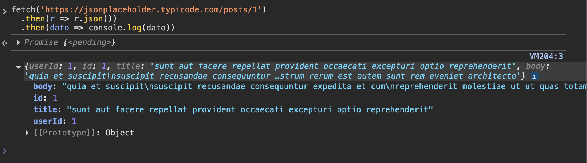
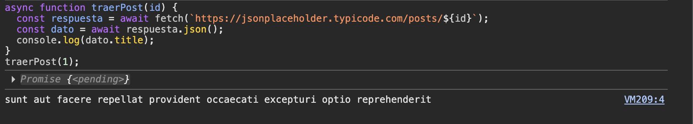
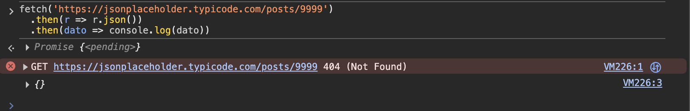
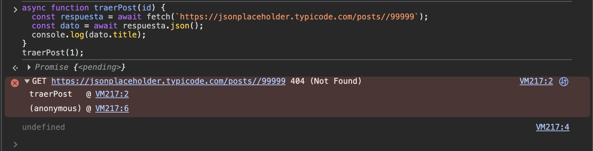
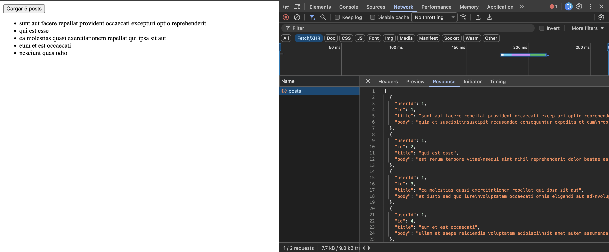
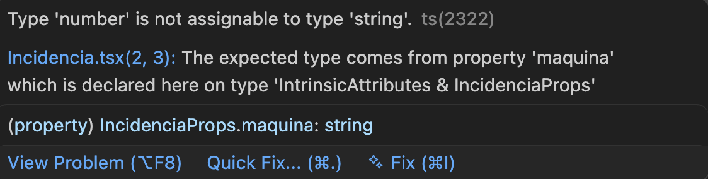
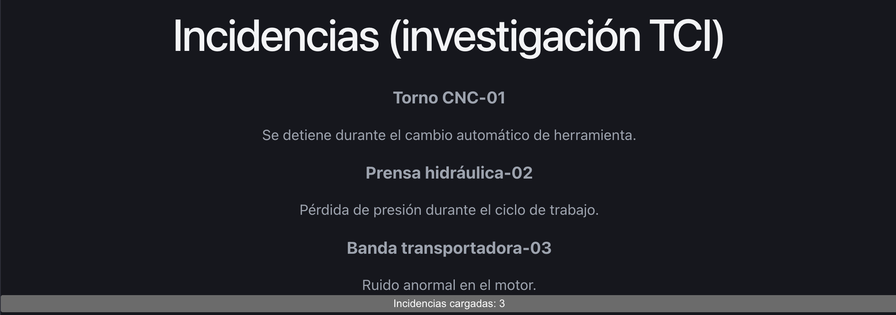
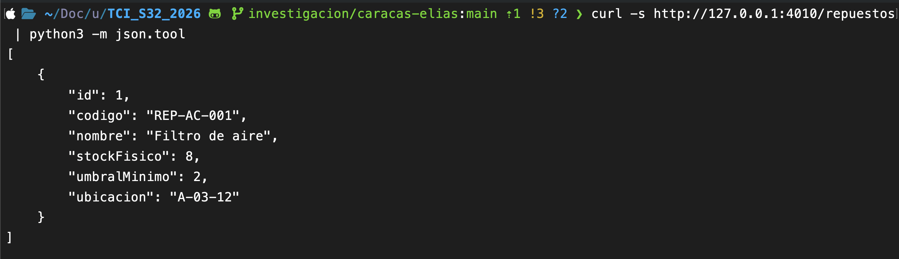
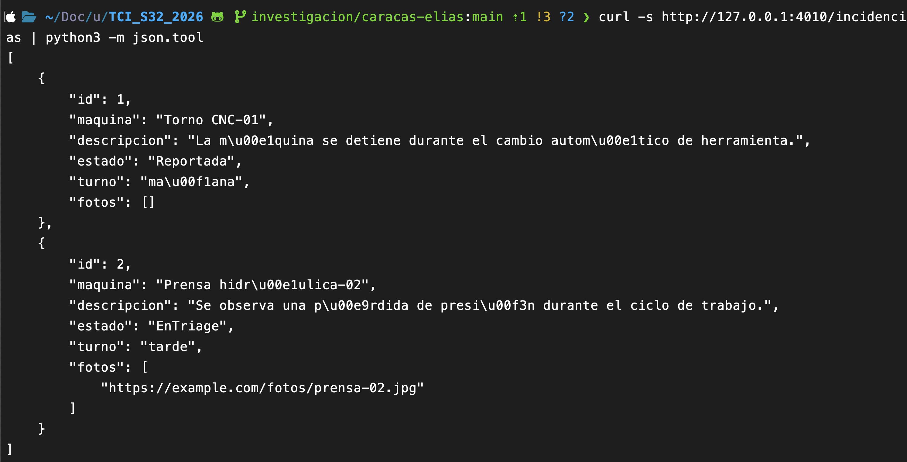

# Investigación — Caracas, Elias (Legajo 31780)

> Nota: legajo verificado contra lo que me diste en esta conversación. El README del equipo tiene cargado el legajo 34575 para vos — revisá cuál es el correcto antes de entregar y, si está mal en el README, corregilo también ahí.

## Parte A — JS asincrónico + fetch + SPA

- Preguntas guía 1, 2, 3 (respuestas en MIS palabras):
  - ¿Qué significa que fetch sea asincrónico? ¿Qué pasaría con la página si no lo fuera?
    JavaScript, en el hilo principal de la página, ejecuta una cosa a la vez. El event loop coordina cuándo se ejecutan las tareas pendientes y es fundamental para entender el asincronismo. Al llamar a fetch, el navegador se encarga de la petición y nos devuelve una promesa que representa su resultado futuro. fetch no es en sí una microtask: las continuaciones de esa promesa, como lo que ejecutamos con .then() o después de un await, se procesan como microtasks.

    La magia es poder decir “cuando tenga el resultado, continúo con esto”, y mientras ese momento llega, seguir ejecutando otras cosas. No doy por finalizada la petición: la dejo pendiente.

    El asincronismo de fetch significa exactamente eso, poder realizar una tarea, en este caso una request, sin bloquear el hilo principal de ejecución mientras espero. Si fuera sincrónico y bloqueara ese hilo, la página podría quedar congelada hasta obtener la respuesta: no podría responder a clics ni actualizar lo que muestra.

    Fuente: [MDN — Modelo de ejecución de JavaScript](https://developer.mozilla.org/en-US/docs/Web/JavaScript/Reference/Execution_model) y [MDN — Using the Fetch API](https://developer.mozilla.org/en-US/docs/Web/API/Fetch_API/Using_Fetch).

  - ¿Por qué `respuesta.json()` también devuelve una promesa?

    Como mencioné antes, hay operaciones cuyo resultado no está disponible inmediatamente. En este caso, respuesta.json() implica leer el cuerpo completo de la respuesta, que todavía puede estar llegando, y después interpretar ese contenido como JSON. Es decir, la promesa de que al terminar de leerlo e interpretarlo, tendré la data que espero.

    No se trata de recorrer un objeto que ya tengo, sino de obtener ese objeto a partir del cuerpo de la respuesta. La espera se debe a la lectura del cuerpo; convertir un texto que ya tengo con JSON.parse() es sincrónico.

    Fuente: [MDN — Response.json()](https://developer.mozilla.org/en-US/docs/Web/API/Response/json).

  - ¿Qué relación hay entre una SPA y fetch? ¿Por qué la SPA "necesita" pedir datos así?

    Una single page application surge como una idea más "reactiva" de renderizar el DOM, plantea "oye, ¿por qué no cargamos toda la página y nos valemos de la naturaleza asíncrona de las peticiones para mostrarlas sin necesidad de recargar siempre el DOM?" fetch es solo una de esas maneras, y se utiliza porque es la forma en que una SPA puede pedir datos a un servidor sin necesidad de estar constantemente recargando la página entera.
    - fuente: documentación general de JavaScript (MDN, javascript.info) y videos de YouTube vistos previamente — estudio propio, no hay una URL puntual de esta sesión.

- Búsquedas (mínimo 2, con fuente y qué entendiste):
  - ¿Qué es una SPA y en qué se diferencia de una MPA? — fuente: documentación general de JavaScript (estudio propio).
    Single hace referencia a que se trabaja sobre un solo documento HTML y se actualizan partes de él. Incluso las transiciones entre pantallas se hacen cambiando lo que mostramos en ese mismo documento. No significa que tengamos todas las pantallas dentro de un HTML muy grande: podemos ir construyéndolas y cargando lo necesario.

  Por la forma en que armamos la aplicación, da la sensación de tener múltiples páginas, pero en realidad es nuestra elección de cómo actualizar el DOM sin cargar un documento nuevo entre transiciones. Una MPA trabaja con múltiples páginas: al navegar de una a otra, el navegador carga otro documento HTML.

  Fuente: [MDN — SPA](https://developer.mozilla.org/en-US/docs/Glossary/SPA).
  - ¿Qué es una promesa y qué problema resuelve? — fuente: javascript.info — Promise (https://es.javascript.info/async).
    Ya lo respondí arriba, en la pregunta guía 1: una promesa es la forma de representar el resultado de una operación que puede no haber terminado todavía. Permite organizar qué hacer cuando termina bien o cuando falla, sin tener que detener la ejecución para esperar ese resultado. La promesa no vuelve asincrónica una operación por sí sola.

  Fuente: [javascript.info — Promesa](https://es.javascript.info/promise-basics).
  - ¿Por qué fetch devuelve una promesa y no el dato directo? — fuente: MDN Web Docs — Using the Fetch API.

    Ya lo respondí arriba, en las preguntas guía 1 y 2: porque la request toma tiempo y `fetch` permite seguir ejecutando otras cosas mientras esperamos. Para devolver directamente la respuesta del servidor, tendría que esperar a tenerla antes de continuar.

    La promesa representa esa respuesta futura. Cuando se cumple, obtenemos un objeto `Response`; después podemos leer su body con `.json()` para obtener los datos.

    Fuente: [MDN — Using the Fetch API](https://developer.mozilla.org/es/docs/Web/API/Fetch_API/Using_Fetch).

  - ¿Qué diferencia hay entre XMLHttpRequest y fetch? — fuente: MDN — XMLHttpRequest y MDN — Using the Fetch API (ver fuente al final de esta respuesta).
    Ambos permiten pedir datos al servidor sin recargar la página. La diferencia principal está en cómo los usamos: XMLHttpRequest maneja la respuesta mediante eventos y callbacks, mientras que fetch devuelve una promesa, por lo que podemos trabajar con .then() o async/await.

    XMLHttpRequest también permite peticiones sincrónicas, aunque bloquearían el hilo principal si las hacemos ahí. fetch trabaja de forma asincrónica. A pesar del nombre, XMLHttpRequest no sirve solo para XML: también puede recibir JSON y otros tipos de datos.

    Fuente: [MDN — XMLHttpRequest](https://developer.mozilla.org/en-US/docs/Web/API/XMLHttpRequest) y [MDN — Using the Fetch API](https://developer.mozilla.org/es/docs/Web/API/Fetch_API/Using_Fetch).

- Evidencia de la actividad guiada:
  - Fetch de un post (`.then`):
    
  - Fetch con async/await:
    
  - Manejo de error (post inexistente, `status 404` / `ok: false`):
    
    
  - Bonus — `investigacion/bonus-fetch-posts.html`, botón que lista los primeros 5 títulos:
    

## Parte B — React + TypeScript + Vite

- Preguntas guía 1, 2, 3:
  - ¿Qué relación ves entre "separar datos de la vista" (taller del 14/09) y el estado de React?

  La idea central acá es: cambio el estado y la vista refleja ese cambio, en lugar de cambiar los datos y después modificar manualmente cada elemento del DOM. En un lenguaje más natural sería "una cosa es lo que tengo y otra es cómo la muestro", en React el estado es "lo que tengo" y el DOM es el cómo la muestro. Ambos conceptos están separados.
  - ¿Por qué `interface IncidenciaProps` evita errores? ¿Dónde "vive" esa verificación?
    Técnicamente hablando no "evita errores", corrige la sintaxis y establece un contrato entre la función y la forma en que va a recibir parámetros, esto es independiente de React, es una característica de TypeScript, en sí TypeScript no es un lenguaje de programación, es más bien una extensión del mismo que permite validar tipos antes de la ejecución real del código, por eso digo que no evita errores más bien previene una mala sintaxis, no garantiza que las responses de una API por ejemplo, sean correctas. La verificación vive justamente en el "ecosistema de TypeScript", que hace un mapeo de los tipos, marca el código con anotaciones que posteriormente al ejecutar JavaScript son eliminadas.

  - ¿Qué hace Vite que antes hacías a mano?

  Antes, preparar la aplicación era como manejar un puesto de hamburguesas: tenía que organizar por mi cuenta quién cocina, quién prepara los pedidos y quién los sirve. En el proyecto, eso significaba configurar el servidor local, transformar TypeScript y JSX a JavaScript, actualizar la página al hacer cambios y preparar los archivos para producción.
  Vite sería una cocina organizada que coordina esas tareas y herramientas. Yo trabajo con los ingredientes, es decir, mi código; y Vite prepara y sirve el resultado al navegador. Mientras desarrollo, actualiza el pedido cuando cambio algo; cuando voy a publicar, prepara todo para llevar.

- Búsquedas (mínimo 2, con fuente y qué entendiste):
  - ¿Qué es un componente en React? — fuente: React docs — Your First Component (https://es.react.dev/learn/your-first-component).
    En esencia es un molde que tiene un comportamiento particular, los componentes son justamente partes fundamentales de una aplicación y que me sirven para no tener que reescribir código una y otra vez, un buen ejemplo son las listas, dentro del componente vive cómo se muestra la lista, qué se hace con ella e incluso su propio estilo, lo único que necesita la lista son datos para trabajar. Esos datos no necesariamente vienen de un contexto global; dependiendo de la arquitectura, el componente también puede tener su propio estado o acceder a datos compartidos mediante contexto.

  - ¿Qué es JSX? — fuente: React docs — Writing Markup with JSX (https://es.react.dev/learn/writing-markup-with-jsx).

    es una extensión de la sintaxis de ... en realidad fue una manera ingeniosa de Jordan Walke de resolver un problema que en su momento estaba empezando a costar tiempo de desarrollo, la idea de Jordan era sencilla, "quiero poder entender claramente cómo se armará mi DOM", pasar de una forma poco estética y poco legible a una más intuitiva, tiene como ventaja además que se compenetra bien con los componentes que deseamos mostrar, un problema de la forma clásica de crear páginas era mostrar secciones de código de manera condicionada, esto requería a cierto nivel escribir cadenas de llamadas, con JSX basta con condicionar la existencia de una parte del DOM dependiendo del valor de un dato.

  - ¿Qué es el estado (useState)? — fuente: React docs — State: A Component's Memory (https://es.react.dev/learn/state-a-components-memory).
    [COMPLETAR]

    Se podría decir que es donde React brilla, o más bien lo que lo hizo atractivo frente a otros frameworks que iban surgiendo en la época, el estado es la forma en que React maneja la memoria entre renderizados, el useState es un hook de React, quizás vale la pena repasar qué es un hook, se suele relacionar mucho con React quizás porque popularizó el término pero un hook en sí es "un punto donde puedo enganchar mi código para intervenir en un proceso", React tiene sus propios hooks e incluso permite crear hooks personalizados, el useState hace justamente eso, se engancha por ejemplo a los componentes y les permite usar las capacidades de React para manejar el estado además de proporcionar una forma de actualizar dicho estado.
    En términos más simples "este dato cambió, ahora necesito mostrarlo con ese cambio" y la "magia" es que al ser una función, no tengo que modificar todo el DOM para renderizar su resultado.

  - ¿Qué son las props? — fuente: React docs — Passing Props to a Component (https://es.react.dev/learn/passing-props-to-a-component).
    [COMPLETAR]

    Las props son la información que un componente padre le pasa a un componente hijo para que trabaje con ella. Siguiendo la idea del molde, las props son los datos con los que uso ese molde: puedo usar el mismo componente Incidencia varias veces, pasando una máquina y una descripción diferentes en cada caso.

- Evidencia:
  - Scaffold real en `investigacion/mi-primera-spa/` (Vite + React + TS, `npm create vite -- --template react-ts`, `npm install` sin errores).
  - `src/Incidencia.tsx`: componente con props tipadas (`IncidenciaProps { maquina: string; descripcion: string }`).
  - `src/App.tsx`: importa `Incidencia` y renderiza 3 incidencias con datos mock, más un `useState` que cuenta incidencias cargadas.
  - `npx tsc -p tsconfig.app.json --noEmit` corre limpio (0 errores) — ver `investigacion/evidencia-texto/`.
  - Error de tipos a propósito: se cambió `maquina={incidencia.maquina}` por `maquina={123}` y el compilador tiró `src/App.tsx(21,11): error TS2322: Type 'number' is not assignable to type 'string'.` (texto real en `investigacion/evidencia-texto/error-tipos-tsc.txt`). Se revirtió después.
    
  - Scaffold andando + componente Incidencia renderizado (las 3 incidencias mock + el contador):
    

## Parte C — Contrato OpenAPI + Prism

- Preguntas guía 1, 2, 3:
  - ¿Por qué conviene definir el contrato antes de codificar? ¿Qué desastre evita?

    Los contratos funcionan como compromisos pero también como guías, justamente te enseñan qué es lo que se espera de tu API en el caso del back o de cómo manejes request en el caso del front, si front y back saben qué espera el uno del otro la iteración al desarrollar es más ágil.
    El desastre que evita es que front y back construyan cosas incompatibles y la integración entre ambas se rompa

  - ¿Cómo ayuda un mock server a que frontend y backend trabajen en paralelo?

    Si hay un contrato establecido, el front ya sabe los formatos y formas que tendrán los datos con los que "alimentará" sus pantallas, es decir puede mockear respuestas de la API con la confianza de que lo que arme a partir de dicho mock se aplique también para la futura conexión con la API real.

  - ¿Qué relación hay entre el contrato OpenAPI y las RN que documentamos en M1?

    OpenAPI es una forma técnica de representar lo que se ilustra en la RN, si construyo un endpoint, sus posibles respuestas y estructura deben satisfacer a la regla de negocio, eso incluye escenarios de error, fallos y éxito.

- Búsquedas (mínimo 2, con fuente y qué entendiste):
  - ¿Qué es un contrato de API? — fuente: OpenAPI — The OpenAPI Specification Explained (https://learn.openapis.org/specification).

    Entendí que es una descripción acordada de cómo usar una API: sus rutas, operaciones, parámetros, datos de entrada y respuestas. OpenAPI permite escribir esa descripción en un formato que pueden interpretar tanto las personas como las herramientas.

  - ¿Qué es un mock server? — fuente: Prism Overview (https://docs.stoplight.io/docs/prism).

    Es un servidor que imita una API y devuelve respuestas simuladas. Prism puede generarlo a partir de un documento OpenAPI, lo que permite probar cómo se consumiría la API antes de implementar el backend.

  - ¿OpenAPI y Swagger son lo mismo? — fuente: Swagger — Basic Structure (https://swagger.io/docs/specification/basic-structure/).

    Sí y no: si tenés más de 10 años programando, podrías interpretarlo como lo mismo, después de todo el nombre original era Swagger y eso abarcaba ambas cosas, formato y herramientas. En 2015, cuando surgió la iniciativa OpenAPI, la confusión era obvia y durante años fueron considerados lo mismo; dicho eso, en la actualidad no lo son: OpenAPI establece el formato que tendrá la API (rutas, endpoints, params, responses), y Swagger es un set de herramientas que te permite interactuar con ese formato, incluso probarlo. Un buen ejemplo es quizás un PDF y un programa que lee/muestra PDF: OpenAPI es el PDF y Swagger sería el lector.

  - ¿Qué es un `$ref`? — fuente: Swagger — Basic Structure (https://swagger.io/docs/specification/basic-structure/).

    $ref -> referencia, permite referenciar una definición ya existente dentro del esquema creado, por ejemplo una vez definida una estructura, se puede hacer referencia a ella en varias partes sin la necesidad de replicar en cada ocasión.

- Evidencia:
  - Contrato usado: `investigacion/actividad-prism/contrato_ejemplo_openapi.yaml` (el de la cátedra, OpenAPI 3.1, endpoints `/incidencias` y `/repuestos`).
  - Prism instalado y corriendo de verdad: `prism mock investigacion/actividad-prism/contrato_ejemplo_openapi.yaml`, escuchando en `http://127.0.0.1:4010` (log real en `investigacion/evidencia-texto/prism-terminal-output.txt`).
  - `curl http://127.0.0.1:4010/repuestos` y `curl http://127.0.0.1:4010/incidencias` devolvieron datos mockeados reales (ver `investigacion/evidencia-texto/prism-repuestos.json` y `prism-incidencias.json`).
    
    

## Reflexión (máx. 5 líneas)

- ¿Qué fue lo que más te costó y cómo lo destrabaste?

  Entender el event loop fue de las cosas más complicadas de entender, es la esencia de JavaScript y luego aplica a cómo funciona el código a nivel front o back, hay muchísimos errores silenciosos que quedan atrapados en promesas sin terminar o un incorrecto manejo de errores para cada caso, lo destrabé con práctica y ejercicios en la consola a la vez que debuggeaba el código. Actualmente hay incluso herramientas online para ver cómo funciona el event loop en tiempo real.
