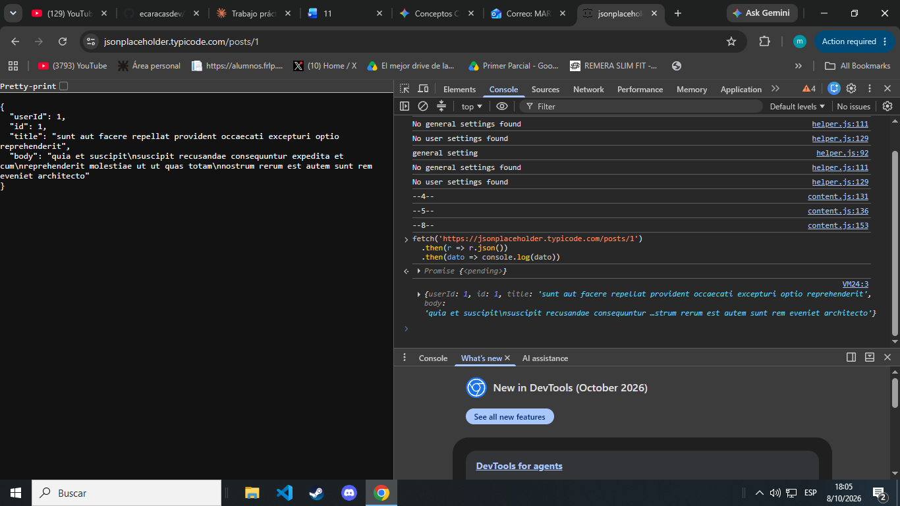
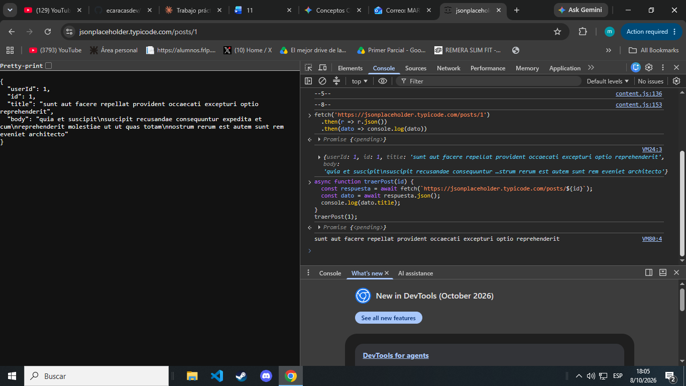
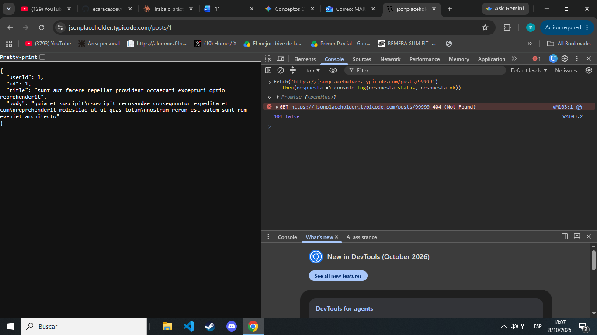
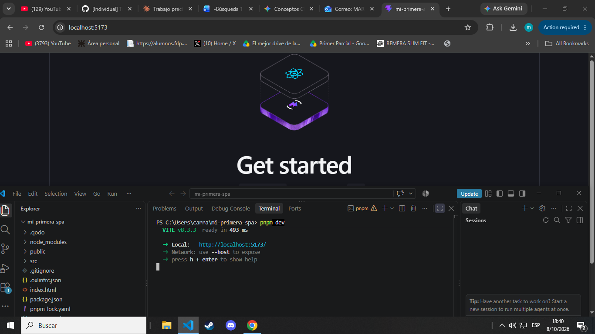
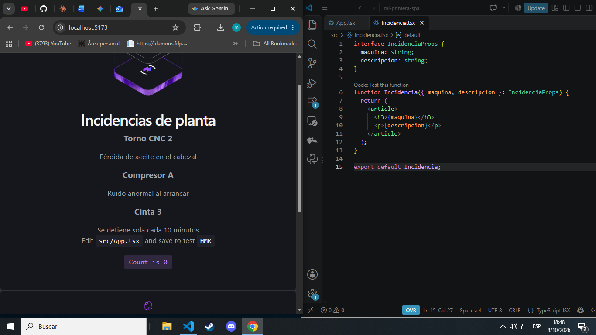
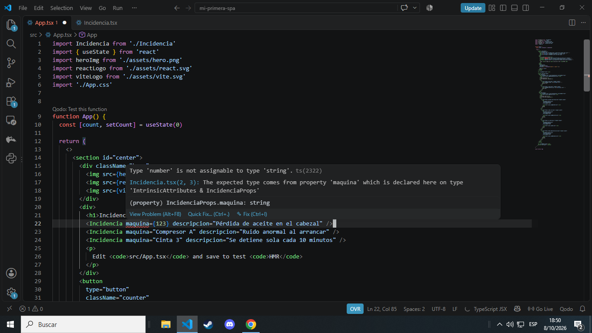
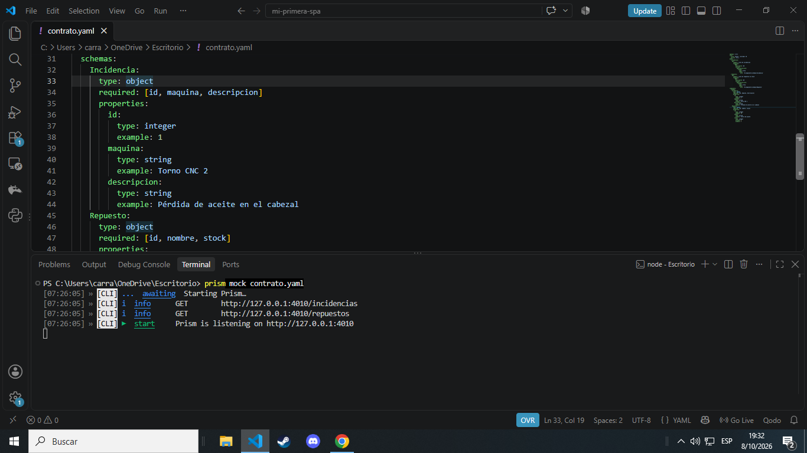
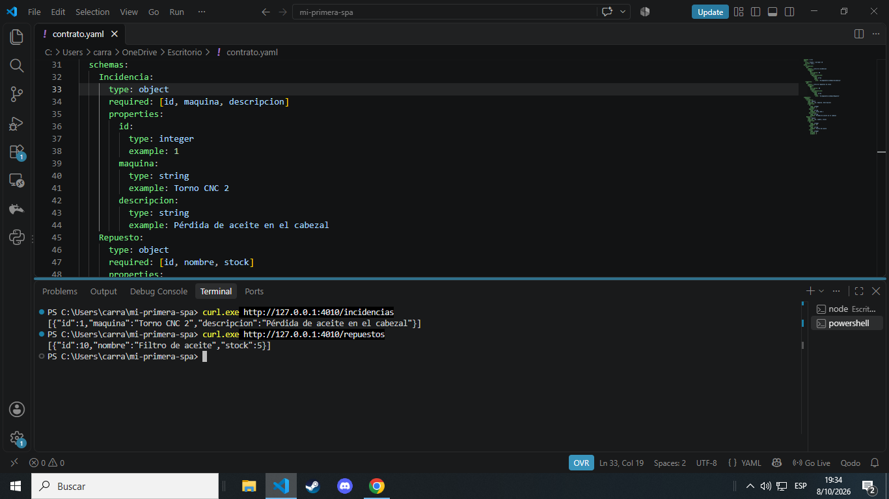

# Investigación — Carrasco, Martin Alejandro (Legajo 32520)

## Parte A — JS asincrónico + fetch + SPA

### Preguntas guía

**1. ¿Qué significa que fetch sea asincrónico? ¿Qué pasaría con la página si no lo fuera?**

Que fetch sea **asincrónico** significa que la petición de red se procesa en segundo plano sin detener la ejecución del resto del código JavaScript.

Si no lo fuera, la ejecución se volvería **bloqueante**: el navegador se congelaría por completo (la página no respondería a clics, *scroll* ni animaciones) hasta que el servidor termine de enviar la respuesta.

**2. ¿Por qué respuesta.json() también devuelve una promesa?**

respuesta.json() devuelve una promesa porque el cuerpo de la respuesta llega desde el servidor de forma progresiva en fragmentos (*stream* de datos).

**3. ¿Qué relación hay entre una SPA y fetch? ¿Por qué la SPA "necesita" pedir datos así?**

Una SPA no recarga la página completa para mostrar contenido nuevo; por eso **necesita** una herramienta como fetch para comunicarse con el servidor en segundo plano.

La relación es directa: la SPA solicita solo los **datos en bruto** (generalmente en JSON) mediante fetch, y JavaScript se encarga de actualizar únicamente la parte de la interfaz que cambió sin interrumpir la navegación ni recargar el navegador.

### Búsquedas

**Búsqueda 1: SPA vs MPA**
- Término buscado: "Single Page Application vs Multi Page Application MDN"
- Fuente: https://developer.mozilla.org/es/docs/Glossary/SPA
- Lo que entendí: Una SPA carga una sola página y actualiza solo las partes que cambian vía JS, mientras que una MPA pide un HTML nuevo al servidor en cada navegación.

**Búsqueda 2: Promesas en JavaScript**
- Término buscado: "JavaScript Promises MDN"
- Fuente: https://developer.mozilla.org/es/docs/Web/JavaScript/Guide/Using_promises
- Lo que entendí: Las promesas representan valores asíncronos futuros y evitan el callback hell, permitiendo estructurar el código con .then() o async/await.

**Búsqueda 3: Por qué fetch devuelve una promesa**
- Término buscado: "JavaScript Fetch API how it works event loop"
- Fuente: https://developer.mozilla.org/es/docs/Web/API/Fetch_API/Using_Fetch
- Lo que entendí: Devuelve una promesa para no congelar el hilo principal ni la interfaz del usuario mientras espera la respuesta de red del servidor.

**Búsqueda 4: XMLHttpRequest vs Fetch**
- Término buscado: "Diferencias XMLHttpRequest y Fetch API"
- Fuente: https://developer.mozilla.org/es/docs/Web/API/Fetch_API
- Lo que entendí: Fetch moderniza las peticiones usando promesas y una sintaxis más clara en lugar de los eventos engorrosos de XHR, exigiendo verificar response.ok para fallos HTTP.

### Evidencia de la actividad guiada (consola)

Captura 1 — fetch con `.then` contra `/posts/1`:

Captura 2 — fetch con `async/await` (`traerPost(1)` imprime el título):

Captura 3 — post inexistente (`/posts/99999`): `404 false`, fetch no rechaza la promesa ante un 404:

---

## Parte B — React + TypeScript + Vite

### Preguntas guía

**1. ¿Qué relación ves entre separar datos de la vista (taller del 14/09) y el estado de React?**

En el taller separabas los datos (el modelo o arreglo de incidencias) de las funciones que manipulaban el DOM manualmente; el estado de React formaliza exactamente eso: la vista es un reflejo automático de los datos. Cambiás el estado y React se encarga solo de redibujar la pantalla, sin que toques el DOM a mano.

**2. ¿Por qué IncidenciaProps evita errores? ¿Dónde vive esa verificación: navegador o editor?**

Evita errores porque define un "contrato" estricto con los datos obligatorios y sus tipos exactos que debe recibir el componente, impidiendo pasar propiedades inexistentes, nombres con errores tipográficos o valores incompletos. Esta verificación vive en el editor (y en el compilador) antes de ejecutar; en el navegador no existe porque TypeScript se compila y se elimina a JavaScript plano.

**3. ¿Qué hace Vite que antes hacías a mano?**

Vite automatiza el servidor de desarrollo local con recarga instantánea (Hot Module Replacement), compila y transforma JSX/TypeScript a JavaScript entendible por el navegador, resuelve las importaciones de paquetes desde npm (node_modules) y optimiza/empaqueta los archivos para producción, reemplazando la inclusión manual de etiquetas `<script>` desordenadas en el `<head>`.

### Búsquedas

**Búsqueda 1: Componentes en React**
- Término buscado: "qué es un componente en React y modularidad de la interfaz"
- Fuente: https://es.react.dev/learn/your-first-component
- Lo que entendí: Un componente es una función que devuelve interfaz reutilizable, lo que permite dividir la vista en piezas modulares, fáciles de aislar, probar y mantener.

**Búsqueda 2: JSX**
- Término buscado: "qué es JSX y por qué se parece a HTML en React"
- Fuente: https://es.react.dev/learn/writing-markup-with-jsx
- Lo que entendí: Es una extensión de sintaxis para JavaScript que compila a llamadas de funciones; se parece a HTML por comodidad, pero admite lógica JS directa y reglas más estrictas.

**Búsqueda 3: useState vs variables comunes**
- Término buscado: "diferencia entre useState y variables comunes en React"
- Fuente: https://es.react.dev/learn/state-a-components-memory
- Lo que entendí: El estado persiste datos entre renderizados y avisa a React que debe redibujar la pantalla cuando cambia, mientras que una variable común se reinicia en cada render y no actualiza la vista.

**Búsqueda 4: Props vs Estado**
- Término buscado: "diferencia entre props y estado en React"
- Fuente: https://es.react.dev/learn/passing-props-to-a-component
- Lo que entendí: Las props son datos de solo lectura que un componente padre le pasa a un hijo, mientras que el estado es privado e interno del componente que lo define.

**Búsqueda 5: TypeScript en Frontend**
- Término buscado: "ventajas de TypeScript en el frontend detección de errores"
- Fuente: https://www.typescriptlang.org/es/docs/handbook/intro.html
- Lo que entendí: Agrega tipado estático que detecta errores tipográficos, tipos incompatibles o accesos indefinidos en tiempo de compilación, antes de que el código llegue a ejecutarse en el navegador.

### Evidencia

Captura 1 — scaffold de Vite andando en `localhost:5173` (con `pnpm dev` corriendo):

Captura 2 — componente `Incidencia` renderizando 3 incidencias, con el código de `Incidencia.tsx`:

Captura 3 — error de tipos (`maquina={123}` donde se espera un `string`):

---

## Parte C — Contrato OpenAPI + Prism

> **Nota:** no pude acceder al archivo `contrato_ejemplo_openapi.yaml` de la cátedra, así que armé un contrato mínimo propio (OpenAPI 3.0.3) con los endpoints `GET /incidencias` y `GET /repuestos`, y lo levanté con Prism.

### Preguntas guía

**1. ¿Por qué conviene definir el contrato antes de codificar frontend y backend? ¿Qué desastre evita?**

Conviene porque fija un acuerdo único sobre qué datos envía y recibe cada parte. Evita el desastre de que el frontend arme pantallas esperando campos o formatos que el backend programó de otra manera, lo que obligaría a reescribir código a último momento por falta de compatibilidad.

**2. ¿Cómo ayuda un mock server a que dos personas (una en frontend, otra en backend) trabajen en paralelo?**

El mock server simula las respuestas de la API según el contrato pactado. Así, la persona de frontend puede maquetar, conectar datos ficticios y probar la interfaz de inmediato sin quedarse esperando a que la persona de backend termine de crear la base de datos o la lógica real.

**3. ¿Qué relación hay entre el contrato OpenAPI y las reglas de negocio (RN-STOCK, RN-UMBRAL) que ya documentaste en la M1?**

OpenAPI traduce esas reglas a código y validaciones concretas: define en los esquemas qué valores numéricos son válidos (mínimos, máximos o tipos) y documenta los errores HTTP exactos (como un código 400 Bad Request o 422) que la API devolverá si se intenta romper una regla de negocio.

### Búsquedas

**Búsqueda 1: Contrato de API**
- Término buscado: "qué es un contrato de API diseño api first"
- Fuente: https://swagger.io/resources/articles/api-first-approach/
- Lo que entendí: Es el acuerdo formal que define endpoints, formatos de datos y respuestas; se pacta antes de programar para que frontend y backend trabajen alineados sin bloquearse mutuamente.

**Búsqueda 2: Mock server y trabajo en paralelo**
- Término buscado: "qué es un mock server y desarrollo en paralelo"
- Fuente: https://postman.com/what-is-a-mock-server/
- Lo que entendí: Es un servidor simulado que devuelve respuestas estáticas definidas en el contrato, permitiendo al frontend desarrollar y probar pantallas sin esperar a que el backend esté listo.

**Búsqueda 3: OpenAPI vs Swagger**
- Término buscado: "diferencia entre OpenAPI y Swagger"
- Fuente: https://swagger.io/docs/specification/about/
- Lo que entendí: OpenAPI es la especificación estándar abierta para describir APIs REST, mientras que Swagger es el conjunto de herramientas comerciales y de código abierto (UI, Editor, Codegen) creadas por SmartBear para trabajar con esa especificación.

**Búsqueda 4: $ref en OpenAPI**
- Término buscado: "para qué sirve ref en OpenAPI especificación"
- Fuente: https://swagger.io/docs/specification/using-ref/
- Lo que entendí: Es una referencia a esquemas o componentes definidos en otra sección del documento, lo que permite reutilizar estructuras de datos, evitar duplicar código y mantener la definición limpia.

### Evidencia

Captura 1 — `prism mock contrato.yaml` corriendo (escuchando en `http://127.0.0.1:4010`, con `GET /incidencias` y `GET /repuestos`):

Captura 2 — petición `curl.exe` al mock y respuesta JSON de `/incidencias` y `/repuestos`:

